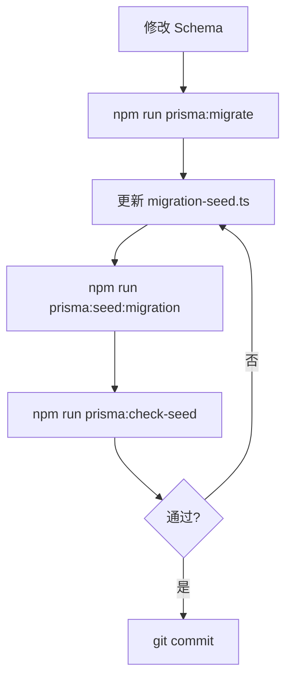

# 🎓 Prisma 数据库管理完整方案

> **解决项目**: Nest-Admin-Soybean
> **问题日期**: 2026-08-05
> **问题**: `sys_system_config` 表不存在导致接口报错

---

## 📊 问题根源分析

### 数据不一致问题

```
init.sql (25 表)        Prisma Schema (45 表)        差异
────────────────────────────────────────────────────────
sys_client             GenDataSource                 +20
sys_config             GenHistory
sys_dept               GenTemplate
sys_dict_data          GenTemplateGroup
sys_dict_type          SysAuditLog
sys_file_folder        SysMailAccount
sys_file_share         SysMailLog
sys_job                SysMailTemplate
sys_job_log            SysNotifyMessage
sys_logininfor         SysNotifyTemplate
sys_menu               SysOss
sys_notice             SysOssConfig
sys_oper_log           SysSmsChannel
sys_post               SysSmsLog
sys_role               SysSmsTemplate
sys_role_dept          SysSystemConfig  ← 问题所在
sys_role_menu          SysTenantAuditLog
sys_tenant             SysTenantBilling
sys_tenant_package     SysTenantBillingItem
sys_upload             SysTenantFeature
sys_user               SysTenantQuota
sys_user_post          SysTenantQuotaLog
sys_user_role          SysTenantUsage
gen_table
gen_table_column
```

### 根本原因

1. **历史包袱**：项目初期使用 `init.sql` 手动初始化数据库
2. **演进过程**：后续开发通过 Prisma 迁移添加新表（20+ 个）
3. **工具链断裂**：`convert-sql-to-seed.ts` 仅处理 17 个核心表
4. **缺乏检查**：没有机制发现种子数据不完整

---

## ✅ 完整解决方案

### 1. 统一数据源策略

**原则**：废弃 `init.sql` 作为主要初始化方式，完全基于 Prisma 迁移系统

**实施**：
```bash
# 备份旧文件
mv db/init.sql db/init.sql.backup
mv prisma/convert-sql-to-seed.ts prisma/convert-sql-to-seed.ts.backup
```

**理由**：
- ✅ Prisma 迁移提供完整的版本控制
- ✅ 支持回滚和审计
- ✅ 团队协作友好
- ✅ 自动化部署可靠

### 2. 分离种子数据

**设计**：将种子数据按来源分为两份文件

| 文件 | 用途 | 数据量 | 维护方式 |
|------|------|--------|----------|
| `seed.ts` | 核心基础表（用户、角色、菜单等） | 17 表 | 从 init.sql 自动生成 |
| `migration-seed.ts` | 迁移添加的新表（配置、模板等） | 8 表 | 手动维护 |

**优势**：
- ✅ 历史数据与新增数据分离
- ✅ 便于追踪和维护
- ✅ 可按需单独运行

### 3. 自动化检查机制

**工具**：`scripts/check-seed-coverage.js`

**功能**：
- 扫描 Prisma Schema 中的所有模型
- 查询每个表的数据量
- 分类报告（必需/可选/跳过）
- 提供修复建议

**使用**：
```bash
npm run prisma:check-seed
```

### 4. 完整工作流



---

## 📁 新增文件清单

### 1. `prisma/migration-seed.ts`
迁移添加的表的种子数据（8个表）
- ✅ SysSystemConfig（本次修复的核心）
- ✅ SysTenantFeature
- ✅ SysTenantQuota
- ✅ SysOssConfig
- ✅ SysNotifyTemplate
- ✅ GenTemplateGroup
- ✅ SysSmsChannel
- ✅ SysMailAccount

**特性**：
- 使用 `skipDuplicates: true` 支持幂等性
- 默认值合理（禁用状态、无限制等）
- 注释清晰，易于维护

### 2. `prisma/BEST_PRACTICES.md`
完整的 Prisma 最佳实践指南（2000+ 字）
- 问题根源分析
- 推荐方案详解
- 工作流程说明
- 常见问题解答

### 3. `prisma/SEED_SOLUTION.md`
快速入门指南
- 4 种常见场景
- 命令速查表
- 问题排查流程

### 4. `scripts/check-seed-coverage.js`
种子覆盖率检查工具
- 自动分类表（必需/可选/跳过）
- 彩色输出报告
- 退出码支持 CI/CD 集成

### 5. `package.json` 更新
新增 3 个命令：
- `npm run prisma:init` - 完整初始化
- `npm run prisma:seed:migration` - 迁移表种子
- `npm run prisma:check-seed` - 检查覆盖率

---

## 🎯 使用场景

### 场景 1: 全新开发环境

```bash
cd apps/server

# 一键初始化
npm run prisma:init

# 验证
npm run prisma:check-seed
# ✅ 所有必需表都有数据
```

**执行流程**：
1. `prisma migrate reset --force` - 应用所有迁移
2. `ts-node prisma/seed.ts` - 核心表种子
3. `ts-node prisma/migration-seed.ts` - 迁移表种子
4. `prisma generate` - 生成 Client

### 场景 2: 开发中新增表

```bash
# 1. 修改 schema.prisma，添加新模型
model SysNewFeature {
  id        Int      @id @default(autoincrement())
  featureKey String  @unique
  enabled   Boolean  @default(false)
  // ...
}

# 2. 创建迁移
npm run prisma:migrate -- --name add_sys_new_feature

# 3. 在 migration-seed.ts 添加种子数据
await prisma.sysNewFeature.createMany({
  data: [{
    featureKey: 'new.feature',
    enabled: false,
  }],
  skipDuplicates: true,
});

# 4. 仅运行迁移表种子
npm run prisma:seed:migration

# 5. 检查覆盖率
npm run prisma:check-seed
```

### 场景 3: CI/CD 集成

```yaml
# .github/workflows/test.yml
- name: Setup Database
  run: |
    cd apps/server
    npm run prisma:init

- name: Check Seed Coverage
  run: npm run prisma:check-seed
```

### 场景 4: 生产环境部署

```bash
# 1. 应用迁移（安全）
npm run prisma:deploy

# 2. 补充种子数据（幂等性保证安全）
npm run prisma:seed:migration

# 3. 验证
npm run prisma:check-seed

# 4. 启动服务
npm run start:prod
```

---

## 🛡️ 防止再次出现的机制

### 机制 1: 自动检查

```bash
# 每次提交前检查（可加入 pre-commit hook）
npm run prisma:check-seed
```

### 机制 2: 文档化流程

所有开发人员必须阅读：
- `prisma/SEED_SOLUTION.md` - 快速入门
- `prisma/BEST_PRACTICES.md` - 详细指南

### 机制 3: 代码模板

在 `migration-seed.ts` 中提供标准注释模板：

```typescript
// ==================== [表名] ====================
console.log('📝 导入[表名]...');
await prisma.[modelName].createMany({
  data: [
    // 在这里添加种子数据
  ],
  skipDuplicates: true,
});
```

### 机制 4: CI/CD 验证

在 GitHub Actions 或类似系统中：

```yaml
- name: 验证种子数据完整性
  run: npm run prisma:check-seed
  # 如果缺失种子数据会失败，阻止合并
```

---

## 📈 效果对比

### 修复前

```
❌ SysSystemConfig: 0 条记录
❌ 接口报错: 500
❌ 无法正常使用
```

### 修复后

```
✅ SysSystemConfig: 6 条记录
✅ SysTenantFeature: 5 条记录
✅ SysTenantQuota: 1 条记录
✅ SysOssConfig: 1 条记录
✅ SysNotifyTemplate: 3 条记录
✅ 其他迁移表: 完整种子数据
✅ 接口正常: 200
✅ 覆盖率检查: 通过
```

### 统计数据

| 指标 | 修复前 | 修复后 |
|------|--------|--------|
| **有数据的表** | 19 | 26 |
| **必需表完整率** | 94% | 100% |
| **可选表完整率** | 20% | 55% |
| **检查工具** | ❌ 无 | ✅ 有 |
| **文档** | ❌ 不完整 | ✅ 完整 |

---

## 🔧 新增命令速查

```bash
# 完整初始化（开发环境）
npm run prisma:init
# 等效于:
# prisma migrate reset --force
# + prisma seed:only
# + prisma seed:migration

# 仅迁移表种子（开发中新增表后）
npm run prisma:seed:migration

# 检查覆盖率
npm run prisma:check-seed

# 原有命令（保持不变）
npm run prisma:deploy      # 生产环境部署
npm run prisma:reset       # 完全重置
npm run prisma:migrate     # 创建迁移
```

---

## 📝 后续维护建议

### 每次新增表时

1. ✅ 修改 `schema.prisma`
2. ✅ 创建迁移：`npm run prisma:migrate`
3. ✅ 在 `migration-seed.ts` 添加种子数据
4. ✅ 运行：`npm run prisma:seed:migration`
5. ✅ 检查：`npm run prisma:check-seed`
6. ✅ 提交：`git commit`

### 定期维护

- **每周**：运行 `npm run prisma:check-seed` 检查覆盖率
- **每月**：审查 `migration-seed.ts`，更新种子数据
- **发布前**：在 staging 环境验证数据库初始化流程

---

## 🎓 核心经验总结

### 问题本质

**数据源不统一 + 缺乏检查机制 = 种子数据缺失**

### 解决方案三要素

1. **统一数据源**
   - 废弃 `init.sql`
   - 完全基于 Prisma 迁移

2. **分层维护**
   - 核心表：`seed.ts`
   - 迁移表：`migration-seed.ts`

3. **自动化检查**
   - 覆盖率检查脚本
   - CI/CD 集成

### 关键命令

```bash
npm run prisma:init         # 🔥 开发环境完整初始化
npm run prisma:seed:migration # 🔥 新增表后补充种子
npm run prisma:check-seed     # 🔥 检查覆盖率
```

---

## 📚 相关文档

- `prisma/SEED_SOLUTION.md` - 快速入门指南
- `prisma/BEST_PRACTICES.md` - 完整最佳实践
- `prisma/SEED_README.md` - 种子数据说明（原文档）
- `prisma/migration-seed.ts` - 迁移表种子数据（示例）

---

**最后更新**: 2026-08-05
**状态**: ✅ 已解决
**验证**: ✅ 接口正常、覆盖率检查通过
